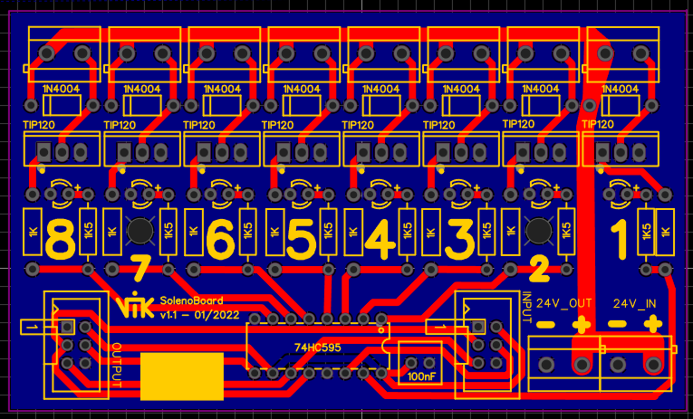
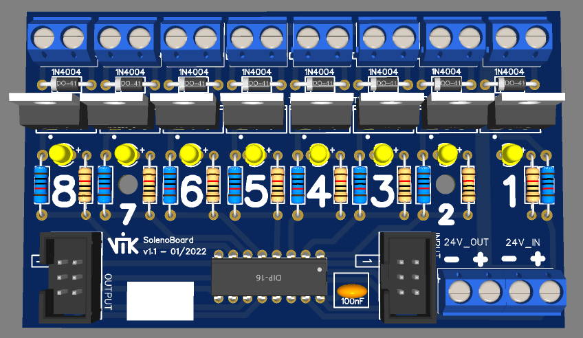

# Solenoid control board
Made specifically for this project, these boards, chained one to each other, accepts 24v input and directly drives solenoids.
Each board have a 74HC595 for output multiplexing.  

Schemas are in EasyEDA format.

  
  
  

